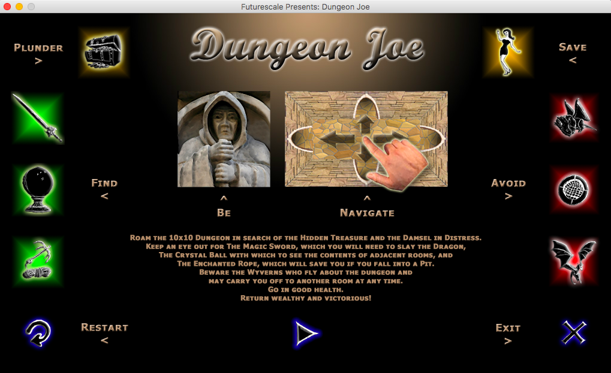

# Dungeon Joe: A Casual Touch-focused Strategy Game

Roam the 10×10 Dungeon in search of the Hidden Treasure and the Damsel in Distress.

Keep an eye out for the Magic Sword, which you will need to slay the Dragon, the Crystal Ball, with which to see the contents of Adjacent Rooms, and the Enchanted Rope, which will save you if you fall into a Pit. Beware the Wyverns who fly about the Dungeon and may carry you off to another room at any time. Go in Good Health, return Wealthy and Victorious!

Read more [here.](http://bit.ly/dungeon-joe)

## Platforms / Technologies
* [PureMVC Standard Framework for AS3](https://github.com/PureMVC/puremvc-as3-standard-framework/wiki)
* [PureMVC State Machine Utility](https://github.com/PureMVC/puremvc-as3-util-statemachine/wiki)
* [ActionScript 3](https://en.wikipedia.org/wiki/ActionScript) 
* [Adobe Flex 4.5](http://www.adobe.com/devnet/flex/articles/introducing-flex45sdk.html)
* [Adobe Air](http://www.adobe.com/products/air/faq.html)

## License
* Dungeon Joe - Copyright © 2011-2017 Cliff Hall 
* PureMVC - Copyright © 2007-2017 Futurescale, Inc.
* All rights reserved.

* Redistribution and use in source and binary forms, with or without modification, are permitted provided that the following conditions are met:

  * Redistributions of source code must retain the above copyright notice, this list of conditions and the following disclaimer.
  * Redistributions in binary form must reproduce the above copyright notice, this list of conditions and the following disclaimer in the documentation and/or other materials provided with the distribution.
  * Neither the name of Futurescale, Inc., PureMVC.org, nor the names of its contributors may be used to endorse or promote products derived from this software without specific prior written permission.

THIS SOFTWARE IS PROVIDED BY THE COPYRIGHT HOLDERS AND CONTRIBUTORS "AS IS" AND ANY EXPRESS OR IMPLIED WARRANTIES, INCLUDING, BUT NOT LIMITED TO, THE IMPLIED WARRANTIES OF MERCHANTABILITY AND FITNESS FOR A PARTICULAR PURPOSE ARE DISCLAIMED. IN NO EVENT SHALL THE COPYRIGHT HOLDER OR CONTRIBUTORS BE LIABLE FOR ANY DIRECT, INDIRECT, INCIDENTAL, SPECIAL, EXEMPLARY, OR CONSEQUENTIAL DAMAGES (INCLUDING, BUT NOT LIMITED TO, PROCUREMENT OF SUBSTITUTE GOODS OR SERVICES; LOSS OF USE, DATA, OR PROFITS; OR BUSINESS INTERRUPTION) HOWEVER CAUSED AND ON ANY THEORY OF LIABILITY, WHETHER IN CONTRACT, STRICT LIABILITY, OR TORT (INCLUDING NEGLIGENCE OR OTHERWISE) ARISING IN ANY WAY OUT OF THE USE OF THIS SOFTWARE, EVEN IF ADVISED OF THE POSSIBILITY OF SUCH DAMAGE.